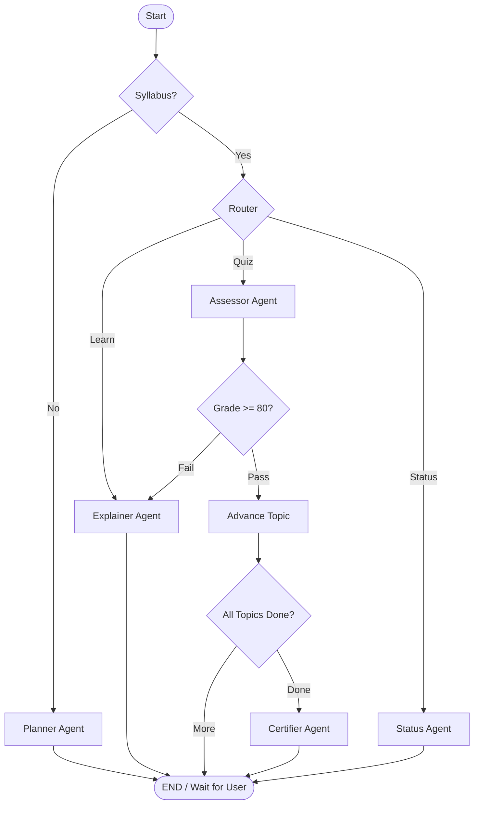

# Enterprise AI Onboarding & Compliance Accelerator (Agentic LMS)

[](https://www.python.org/)
[](https://github.com/langchain-ai/langgraph)
[](https://fastapi.tiangolo.com/)
[](LICENSE)

An enterprise-grade, multi-agent Learning Management System (LMS) designed to automate employee onboarding through **Agentic RAG** and **Flow Engineering**. Built with LangGraph and Google Gemini.

---

## 🚀 Overview

The **Enterprise AI Onboarding LMS** transforms static compliance training into an interactive, personalized journey. Using a team of specialized AI agents, the system plans a custom syllabus, teaches internal policies using RAG, assesses understanding through free-text reasoning, and requires human oversight for final certification.

### Key Features
- **🎯 Personalized Planning**: Dynamically generates a syllabus based on employee roles.
- **📚 Agentic RAG**: Explainer Agent retrieves and teaches ground-truth company SOPs.
- **⚖️ LLM-as-a-Judge**: Assessor Agent evaluates complex answers against compliance standards.
- **🔄 State Persistence**: Resumable sessions using SQLite/PostgreSQL checkpointers.
- **👨‍✈️ Human-in-the-Loop**: Integrated supervisor approval gate for certification.
- **📊 Observability**: Full tracing and evaluation via Langfuse.

---

## 🏗️ Architecture

The system is orchestrated as a directed graph using **LangGraph**, enabling non-linear state transitions and reliable multi-agent collaboration.



---

## 🛠️ Tech Stack

- **Core**: Python 3.12+, LangGraph, LangChain
- **LLM**: Google Gemini 3 Flash Preview (standardized across all agents)
- **Database**: 
  - **Vector**: ChromaDB (RAG)
  - **Relational**: PostgreSQL / SQLite (Persistence)
- **Backend**: FastAPI with Server-Sent Events (SSE)
- **Frontend**: React, Vite, Vanilla CSS
- **Observability**: Langfuse

---

## 🚦 Getting Started

### Prerequisites
- Python 3.12 or higher
- Node.js & npm (for frontend)
- Google Gemini API Key

### Backend Setup
1. **Clone the repository**:
   ```bash
   git clone https://github.com/WillyHanafi1/Enterprise-AI-Onboarding-Compliance-Accelerator-Agentic-LMS-.git
   cd Enterprise-AI-Onboarding-Compliance-Accelerator-Agentic-LMS-
   ```

2. **Install dependencies**:
   ```bash
   python -m venv venv
   source venv/bin/activate  # On Windows: .\venv\Scripts\activate
   pip install .[dev]
   ```

3. **Configure Environment**:
   Create a `.env` file in the root:
   ```env
   GEMINI_API_KEY=your_key_here
   DATABASE_URL=sqlite:///checkpointer.db
   LANGFUSE_PUBLIC_KEY=...
   LANGFUSE_SECRET_KEY=...
   ```

> [!IMPORTANT]
> This project is standardized to use `gemini-3-flash-preview` across all agents and evaluation judges to ensure high-fidelity reasoning and consistent structured outputs.

4. **Ingest Documents (RAG)**:
   Place your markdown SOPs in `data/sops/` and run:
   ```bash
   python scripts/ingest_sops.py
   ```

5. **Run the Server**:
   ```bash
   python -m src.api.server
   ```

### Frontend Setup
1. **Navigate to frontend**:
   ```bash
   cd frontend
   npm install
   ```

2. **Run Development Server**:
   ```bash
   npm run dev
   ```

---

## 🧪 Testing

The project uses `pytest` for rigorous testing of agents and graph logic:
```bash
pytest tests/test_graph.py
pytest tests/test_agents.py
```

---

## 📝 License
This project is licensed under the MIT License - see the [LICENSE](LICENSE) file for details.

---
*Built for the future of Enterprise AI Onboarding.*
