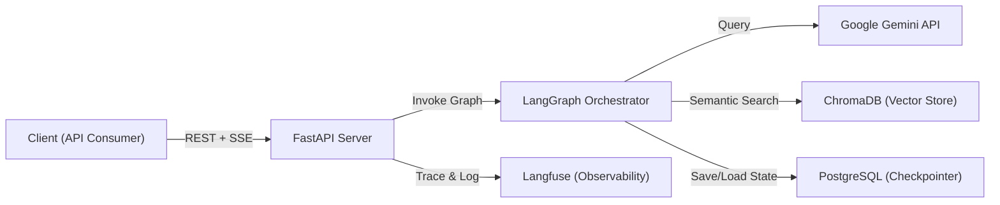
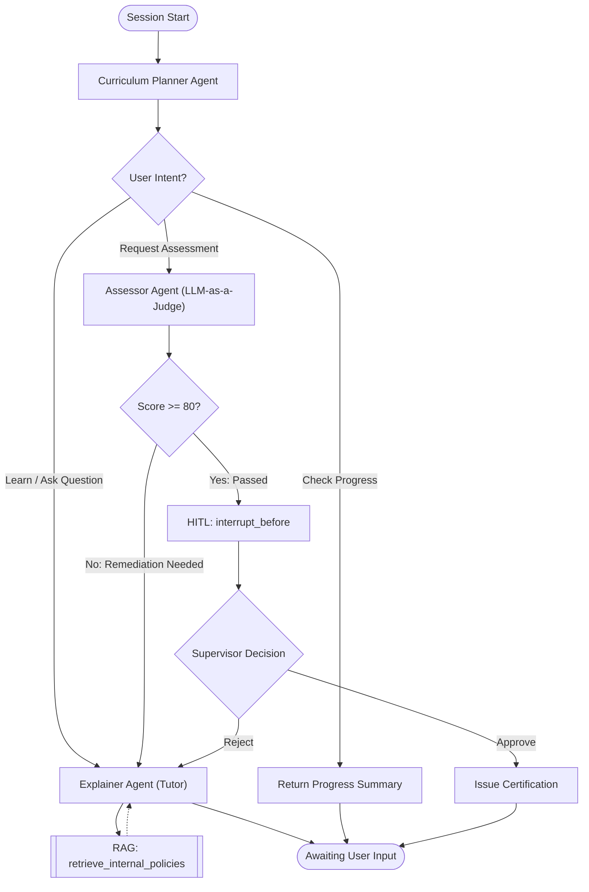

# System Architecture & Agent Workflow
## Enterprise AI Onboarding & Compliance Accelerator

| Field | Detail |
|---|---|
| **Document Status** | Draft v2 |
| **Last Updated** | May 2026 |
| **Related Docs** | [PRD.md](./PRD.md) · [TECH_STACK.md](./TECH_STACK.md) |

---

## 1. High-Level System Architecture

The system follows a **Backend-Heavy, API-First** architecture. All AI computation, RAG retrieval, and agent orchestration are isolated on the backend server. The client communicates exclusively through RESTful API endpoints with SSE (Server-Sent Events) for real-time streaming.

### 1.1 Component Diagram



### 1.2 Core Components

| # | Component | Technology | Responsibility |
|---|---|---|---|
| 1 | **API Gateway** | FastAPI + Uvicorn | Handles HTTP requests, SSE streaming, CORS, authentication |
| 2 | **Graph Orchestrator** | LangGraph | Manages agent state machine, routing, conditional edges |
| 3 | **LLM Provider** | Google Gemini API (gemini-3-flash-preview) | Cloud inference; provides high-speed processing and large context |
| 4 | **Vector Store** | ChromaDB | Stores document embeddings for semantic retrieval |
| 5 | **State Persistence** | PostgreSQL / SQLite | Persists conversation state via LangGraph Checkpointer |
| 6 | **Observability** | Langfuse | Tracing, latency monitoring, token cost tracking |

---

## 2. LangGraph State Schema

The central state object that flows through all nodes in the graph. Every agent reads from and writes to this shared state.

```python
from typing import TypedDict, Annotated, List, Optional
from langgraph.graph.message import add_messages
from langchain_core.messages import BaseMessage

class OnboardingState(TypedDict):
    # === Conversation Memory ===
    messages: Annotated[List[BaseMessage], add_messages]
    
    # === Employee Context ===
    employee_role: str                   # e.g., "Software Engineer", "Sales"
    employee_name: str                   # For personalized interactions
    
    # === Curriculum Tracking ===
    syllabus: List[str]                  # Ordered list of topics to cover
    current_topic: str                   # Active topic being studied
    completed_topics: List[str]          # Topics already covered
    
    # === Assessment Tracking ===
    quiz_score: int                      # Latest score (0-100)
    failed_attempts: int                 # Consecutive failures on current topic
    assessment_history: List[dict]       # [{topic, score, feedback, timestamp}]
    
    # === Workflow Control ===
    is_certified: bool                   # True if passed & supervisor approved
    requires_human_review: bool          # Flag to trigger HITL interrupt
    current_agent: Optional[str]         # Which agent is currently active
```

### State Field Justification

| Field | Purpose |
|---|---|
| `syllabus` / `completed_topics` | Enables the Curriculum Planner to track learning progress and decide what topic to teach next. |
| `assessment_history` | Provides the Supervisor with a full audit trail during HITL review. |
| `failed_attempts` | Triggers re-routing to Explainer after repeated failures (prevents infinite assessment loops). |
| `requires_human_review` | Explicit flag that triggers `interrupt` for HITL gate. |

---

## 3. Agent Definitions

### 3.1 Agent Inventory

| Agent | Node Name | LangGraph Role | Tools |
|---|---|---|---|
| **Router** | `route_intent` | Conditional Edge | — (classification only) |
| **Curriculum Planner** | `planner_node` | Worker Node | `retrieve_internal_policies` |
| **Explainer (Tutor)** | `explainer_node` | Worker Node | `retrieve_internal_policies` |
| **Assessor (Evaluator)** | `assessor_node` | Worker Node | `generate_evaluation_rubric` |
| **Certifier** | `certifier_node` | Terminal Node | — (issues certificate) |

### 3.2 Agent Descriptions

**Router (Conditional Edge):**
Classifies user intent into one of: `learn`, `quiz`, or `status`. Routes to the appropriate agent node. Not a full LLM call — can be a lightweight classifier or keyword-based.

**Curriculum Planner (Agent 1):**
Invoked at session start or when a new SOP document is uploaded. Reads the document structure and generates an ordered `syllabus` in the state. Considers the employee's role to prioritize relevant sections.

**Explainer / Tutor (Agent 2):**
The primary learning interface. Retrieves relevant SOP chunks via RAG and explains them in conversational, digestible language. Strictly grounded in retrieved context (system prompt forbids external knowledge). Updates `completed_topics` when a topic is fully covered.

**Assessor / Evaluator (Agent 3):**
Generates case-study style questions about the current topic. Uses a separate LLM call (LLM-as-a-judge pattern) to grade the trainee's response against a rubric. Updates `quiz_score` and `assessment_history`. If score < 80, routes back to Explainer for remediation.

**Certifier (Terminal Node):**
Only reachable after Assessor confirms pass (score ≥ 80) AND Supervisor approves via HITL. Issues the final certification record.

---

## 4. Agent Workflow (Graph Design)



### 4.1 Key Design Decisions

| Decision | Rationale |
|---|---|
| **Planner runs first** | The system must generate a syllabus before any learning can happen. This ensures structured, not random, learning. |
| **Fail → Explainer (not Assessor)** | When a trainee fails, they need to re-learn the material, not just re-take the quiz. This prevents brute-force guessing. |
| **HITL uses `interrupt_before`** | LangGraph's native interrupt mechanism persists the full state to the checkpointer. The Supervisor can review and resume days later without data loss. |
| **Router is a Conditional Edge** | Keeps the router lightweight (no full LLM invocation), reducing latency for every user message. |

---

## 5. API Contract (Endpoint Design)

| Method | Endpoint | Description | Auth |
|---|---|---|---|
| `POST` | `/api/v1/sessions` | Create a new onboarding session (returns `session_id`) | API Key |
| `POST` | `/api/v1/sessions/{id}/chat` | Send a message (SSE streaming response) | API Key |
| `GET` | `/api/v1/sessions/{id}/status` | Get current session progress and scores | API Key |
| `POST` | `/api/v1/sessions/{id}/approve` | Supervisor approves certification (resumes HITL) | API Key |
| `POST` | `/api/v1/sessions/{id}/reject` | Supervisor rejects, trainee returns to learning | API Key |
| `POST` | `/api/v1/documents/ingest` | Upload and process SOP documents into vector store | API Key |

---

## 6. RAG & Tool Definitions

| Tool | Signature | Used By | Description |
|---|---|---|---|
| `retrieve_internal_policies` | `(query: str) → List[Document]` | Explainer, Planner | Semantic search on ChromaDB. Returns top-k relevant SOP chunks with metadata (source file, page number). |
| `generate_evaluation_rubric` | `(topic: str) → str` | Assessor | Generates a grading rubric for the given topic to ensure consistent, fair evaluation. |

### 6.1 RAG Pipeline Design

```text
PDF/Markdown Upload
    → Text Extraction (Markdown/Text Native Loaders)
    → Chunking (RecursiveCharacterTextSplitter, chunk_size=1000, overlap=200)
    → Embedding (models/gemini-embedding-001 via Gemini API)
    → Store in ChromaDB with metadata (filename, page_number, section_header)
    → Query: Semantic search with MMR (Maximal Marginal Relevance) for diversity
```

---

## 7. Error Handling Strategy

| Failure Scenario | Handling Strategy |
|---|---|
| **Gemini API rate limit exceeded** | Implement exponential backoff. Return HTTP 429 if retries fail. |
| **ChromaDB returns empty results** | Agent responds: "I couldn't find information about this topic in the uploaded documents. Please verify the SOP has been ingested." |
| **LLM generates malformed JSON** | Pydantic validation catches the error. Retry with structured output parsing (up to 3 attempts). |
| **Checkpointer DB connection lost** | Log error to Langfuse. Return HTTP 500. Session can be recovered once DB is restored (state was persisted at last successful checkpoint). |
| **Supervisor never approves** | Session remains in `interrupted` state indefinitely. Add optional TTL (time-to-live) notification via future webhook integration. |

---

## 8. Directory Structure (Modularity)

```text
project-root/
├── docs/                       # Project documentation (PRD, Architecture, etc.)
├── data/                       # Sample SOP documents for testing
├── src/
│   ├── __init__.py
│   ├── core/                   # Configuration, LLM clients, DB connections
│   │   ├── __init__.py
│   │   ├── config.py           # Environment variables (via pydantic-settings)
│   │   ├── llm.py              # LLM provider factory (Gemini / Groq)
│   │   └── database.py         # Checkpointer & ChromaDB initialization
│   ├── schemas/                # Pydantic models & LangGraph State
│   │   ├── __init__.py
│   │   ├── state.py            # OnboardingState TypedDict
│   │   ├── requests.py         # API request models
│   │   └── responses.py        # API response models
│   ├── agents/                 # Agent logic (one file per agent)
│   │   ├── __init__.py
│   │   ├── planner.py          # Curriculum Planner Agent
│   │   ├── explainer.py        # Explainer / Tutor Agent
│   │   ├── assessor.py         # LLM-as-a-Judge Assessor Agent
│   │   └── tools.py            # RAG retriever & rubric generator
│   ├── graph/                  # LangGraph assembly
│   │   ├── __init__.py
│   │   └── workflow.py         # Node + Edge compilation
│   ├── ingestion/              # Document processing pipeline
│   │   ├── __init__.py
│   │   └── pipeline.py         # PDF loading, chunking, embedding
│   └── api/                    # FastAPI application
│       ├── __init__.py
│       ├── server.py           # App factory, middleware, lifespan
│       ├── routers.py          # Endpoint definitions
│       └── dependencies.py     # Dependency injection (DB sessions, etc.)
├── tests/                      # Pytest test suite
│   ├── test_agents.py
│   ├── test_graph.py
│   └── test_api.py
├── pyproject.toml              # Project metadata & dependencies (uv/Poetry)
├── Dockerfile                  # Container definition
├── docker-compose.yml          # Multi-service orchestration
├── .env.example                # Environment variable template
└── README.md                   # Project overview & setup instructions
```

---

*Architecture document aligned with [PRD.md](./PRD.md) features F1–F5.*
